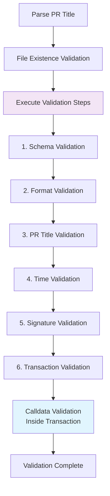

# 🔍 Validation Guide

This document explains the detailed operation and security features of the DAO agenda metadata validation system.

## 📋 Table of Contents

1. [Validation Process Overview](#validation-process-overview)
2. [Individual Validation Execution](#individual-validation-execution)
3. [PR Title Validation](#pr-title-validation)
4. [File Existence Validation](#file-existence-validation)
5. [Time-based Security Validation](#time-based-security-validation)
6. [Schema Validation](#schema-validation)
7. [Signature Validation](#signature-validation)
8. [Transaction Validation](#transaction-validation)
9. [Calldata Validation](#calldata-validation)
10. [Error Resolution](#error-resolution)

## 🔄 Validation Process Overview

Metadata validation proceeds with the following flow:



### Validation Flow Description

1. **Parse PR Title**: Extract network, ID, and creation/update status from title
2. **File Existence Validation**: Check file existence based on creation/update
3. **Execute Validation Steps**: Run user-selected validation steps sequentially
   - Each step can be executed independently
   - Stops immediately on failure
4. **Calldata Validation**: Automatically executed within transaction validation

**Implementation Code**: [`src/validators/validate-metadata.ts`](../src/validators/validate-metadata.ts)

## 🎯 Individual Validation Execution

The validation system provides functionality to selectively execute individual validation steps. This enables quick debugging and step-by-step development.

### Available Validation Steps

| Step | Description | Execution Time |
|------|-------------|----------------|
| `schema` | JSON schema validation | Fast ⚡ |
| `format` | File format and path validation | Fast ⚡ |
| `pr-title` | PR title consistency validation | Fast ⚡ |
| `time` | Time validation (1-hour rule) | Fast ⚡ |
| `signature` | Signature validation | Medium 🔄 |
| `transaction` | On-chain transaction validation | Slow 🐌 |
| `all` | All validation steps (default) | Slow 🐌 |

### Basic Usage

```bash
# Execute all validations (default)
npm run validate -- --pr-title "[Agenda] sepolia - 64 - Test Agenda" data/agendas/sepolia/agenda-64.json

# Show help
npm run validate -- --help
```

### Validation Examples

```bash
# Full validation
npm run validate -- --pr-title "[Agenda] sepolia - 64 - Test Agenda" data/agendas/sepolia/agenda-64.json

# Individual steps
npm run validate -- --check schema data/agendas/sepolia/agenda-64.json
npm run validate -- --check signature data/agendas/sepolia/agenda-64.json
npm run validate -- --check transaction data/agendas/sepolia/agenda-64.json
```

### Execution Result Example

```bash
🚀 Starting validation with steps: schema, format, pr-title, time
🔍 Running schema validation...
✅ Schema validation passed
🔍 Running format validation...
✅ Format validation passed
🔍 Running pr-title validation...
✅ PR title validation passed
🔍 Running time validation...
✅ Time validation passed
✅ data/agendas/sepolia/agenda-64.json is valid (schema, format, pr-title, time validations passed).
```

### Development Workflow

```bash
# Quick validation (schema + format)
npm run validate:quick

# Local validation (no RPC calls)
npm run validate:local

# Full validation (including on-chain)
npm run validate
```

> 💡 **Tip**: During development, primarily use `validate:local` and only execute `validate` with transaction validation before final submission for efficiency.

### Performance Optimization

- **Local validation**: `schema,format,pr-title,time` (no on-chain calls, very fast)
- **Signature validation**: `signature` (cryptographic operations, medium speed)
- **Transaction validation**: `transaction` (RPC calls, network dependent)

**Implementation Code**: [`src/validators/validate-metadata.ts`](../src/validators/validate-metadata.ts#L45-L90)

## 🏷️ PR Title Validation

### Title Rules

**Creation (Create)**:
```
[Agenda] <network> - <id> - <title>
```

**Update**:
```
[Agenda Update] <network> - <id> - <title>
```

### Examples

✅ **Correct Examples**:
- `[Agenda] sepolia - 123 - Increase Treasury Allocation`
- `[Agenda Update] mainnet - 456 - Updated Treasury Proposal`

❌ **Incorrect Examples**:
- `[Agenda] invalid-network - 123 - Title` (invalid network)
- `[Agenda] sepolia - abc - Title` (non-numeric ID)
- `[Wrong] sepolia - 123 - Title` (incorrect prefix)

**Implementation Code**: [`src/utils/validation-helpers.ts`](../src/utils/validation-helpers.ts#L45-L65)

## 📁 File Existence Validation

### Creation Validation
- File **must not exist** at the path
- Ensures new agenda creation

### Update Validation
- File **must exist** at the path
- Ensures existing agenda modification

**Implementation Code**: [`src/validators/validate-metadata.ts`](../src/validators/validate-metadata.ts#L60-L85)

## ⏰ Time-based Security Validation

### Metadata Time Fields

```json
{
  "createdAt": "2024-01-01T00:00:00.00Z",  // Required (ISO 8601 Extended Format)
  "updatedAt": "2024-01-02T00:00:00.00Z"   // Required only for updates
}
```

### Signature Message Format

> **Note**: Signature message templates are centrally managed in [`src/config/signature-messages.ts`](../src/config/signature-messages.ts).

**For Creation**:
```
I am the one who submitted agenda #<id> via transaction <tx-hash>. I am creating this metadata at <timestamp>. This signature proves that I am the one who submitted this agenda.
```

**For Update**:
```
I am the one who submitted agenda #<id> via transaction <tx-hash>. I am updating this metadata at <timestamp>. This signature proves that I am the one who submitted this agenda.
```

### Security Rules

1. **Time Validity**: Signatures expire after 1 hour (see [Signature Guide](./signature-guide.md))
2. **Time Consistency**: Signature timestamp must exactly match metadata time field
3. **Update Time Sequence**: `updatedAt` must be later than `createdAt`

### Validation Logic

```typescript
// Time validation example
const signatureTime = new Date(creator.signature.timestamp);
const currentTime = new Date();
const timeDiff = currentTime.getTime() - signatureTime.getTime();

if (timeDiff > 60 * 60 * 1000) { // 1 hour in milliseconds
  throw new Error("Signature has expired");
}
```

**Implementation Code**: [`src/validators/agenda-validator.ts`](../src/validators/agenda-validator.ts#L120-L150)

## 📋 Schema Validation

### Zod Schema-based Validation

The system uses Zod for type-safe schema validation:

```typescript
import { AgendaMetadataSchema } from '../types/agenda-metadata';

const result = AgendaMetadataSchema.safeParse(metadata);
if (!result.success) {
  throw new Error(`Schema validation failed: ${result.error.message}`);
}
```

### Validated Fields

- **Basic Fields**: `id`, `title`, `description`, `network`
- **Transaction**: `transaction` (Ethereum transaction hash)
- **Creator**: `address`, `signature` object
- **Actions**: Array of action objects with `contractAddress`, `calldata`, etc.
- **Time Fields**: `createdAt`, `updatedAt` (ISO 8601 format)
- **Optional Fields**: `memo`, `snapshotUrl`, `discourseUrl`

### Format Validation

- **Transaction Hash**: Must be valid Ethereum transaction hash (0x + 64 hex characters)
- **Address**: Must be valid Ethereum address (0x + 40 hex characters)
- **Time Format**: ISO 8601 Extended Format with centisecond precision (`YYYY-MM-DDTHH:mm:ss.ssZ`)
- **Network**: Must be one of supported networks (`sepolia`, `mainnet`)

**Implementation Code**: [`src/types/agenda-metadata.ts`](../src/types/agenda-metadata.ts)

## ✍️ Signature Validation

### Signature Process

1. **Message Generation**: Create standardized message based on agenda data
2. **Signature Verification**: Verify signature matches the message and address
3. **Address Consistency**: Ensure signature address matches transaction sender

### Message Template

```typescript
const message = isUpdate
  ? `I am the one who submitted agenda #${id} via transaction ${txHash}. I am updating this metadata at ${timestamp}. This signature proves that I am the one who submitted this agenda.`
  : `I am the one who submitted agenda #${id} via transaction ${txHash}. I am creating this metadata at ${timestamp}. This signature proves that I am the one who submitted this agenda.`;
```

### Verification Logic

```typescript
import { verifyMessage } from 'ethers';

const recoveredAddress = verifyMessage(message, signature);
if (recoveredAddress.toLowerCase() !== expectedAddress.toLowerCase()) {
  throw new Error('Signature verification failed');
}
```

**Implementation Code**: [`src/validators/agenda-validator.ts`](../src/validators/agenda-validator.ts#L80-L120)

## 🔗 Transaction Validation

### On-chain Data Verification

1. **Transaction Existence**: Verify transaction exists on specified network
2. **Sender Verification**: Check transaction sender matches creator address
3. **Calldata Validation**: Verify transaction calldata matches metadata actions

### RPC Provider Configuration

The validation system uses a centralized configuration approach for RPC endpoints and other constants:

```typescript
import { getRpcUrl } from '../config/rpc';
import { TIME_CONSTANTS, VALIDATION_CONSTANTS } from '../config/constants';
import { ethers } from 'ethers';

const provider = new ethers.JsonRpcProvider(getRpcUrl(network));
const transaction = await provider.getTransaction(txHash);
```

#### Configuration Structure
- **Constants**: All validation constants centralized in `src/config/constants.ts`
- **ABI Management**: Contract ABIs managed in `src/config/abi-loader.ts`
- **RPC Configuration**: Network endpoints in `src/config/rpc.ts`

For complete configuration details, see [Configuration Guide](./configuration-guide.md).

### Transaction Structure Validation

```typescript
// Expected transaction structure for DAO proposals
const expectedTo = "0x..."; // DAOCommitteeProxy address
const expectedMethodId = "0x..."; // approveAndCall method signature

if (transaction.to !== expectedTo) {
  throw new Error('Invalid transaction recipient');
}
```

**Implementation Code**: [`src/validators/validate-metadata.ts`](../src/validators/validate-metadata.ts#L150-L200)

## 🔍 Calldata Validation

### TON → DAOCommitteeProxy Flow

The validation system verifies the complete calldata flow:

1. **TON.approveAndCall**: User approves TON spending and calls DAOCommitteeProxy
2. **DAOCommitteeProxy.execute**: Executes multiple actions with addresses and calldata arrays
3. **Metadata Actions**: Must match the on-chain calldata exactly

### Calldata Decoding

```typescript
import { ethers } from 'ethers';

// Decode approveAndCall data parameter
const executeInterface = new ethers.Interface([
  "function execute(address[] calldata targets, bytes[] calldata calldatas)"
]);

const decodedData = executeInterface.decodeFunctionData("execute", data);
const [addresses, calldatas] = decodedData;
```

### Validation Logic

```typescript
// Verify addresses match
for (let i = 0; i < metadata.actions.length; i++) {
  if (addresses[i].toLowerCase() !== metadata.actions[i].contractAddress.toLowerCase()) {
    throw new Error(`Address mismatch at index ${i}`);
  }
}

// Verify calldata matches
for (let i = 0; i < metadata.actions.length; i++) {
  if (calldatas[i] !== metadata.actions[i].calldata) {
    throw new Error(`Calldata mismatch at index ${i}`);
  }
}
```

**Implementation Code**: [`src/validators/validate-metadata.ts`](../src/validators/validate-metadata.ts#L200-L250)

## 🛠️ Error Resolution

### Common Error Types

#### 1. Schema Validation Errors
```
❌ Schema validation failed: Required field 'title' is missing
```
**Solution**: Add all required fields according to schema

#### 2. Time Validation Errors
```
❌ Signature has expired. Signature time: 2024-01-01T10:00:00.00Z, Current time: 2024-01-01T12:00:00.00Z
```
**Solution**: Generate new signature within 1 hour

#### 3. Signature Verification Errors
```
❌ Signature verification failed. Expected: 0x123..., Got: 0x456...
```
**Solution**: Ensure signature was created with correct private key

#### 4. Transaction Validation Errors
```
❌ Transaction not found: 0x123...
```
**Solution**: Verify transaction hash exists on specified network

#### 5. Calldata Validation Errors
```
❌ Address mismatch at index 0. Expected: 0x123..., Got: 0x456...
```
**Solution**: Ensure metadata actions match transaction calldata exactly

### Debugging Steps

1. **Use Individual Validation**: Test each step separately
2. **Check Logs**: Review detailed error messages
3. **Verify Data**: Cross-check all fields manually
4. **Test Locally**: Use `validate:local` for quick iteration

### Performance Troubleshooting

- **Slow RPC Calls**: Use different RPC endpoint or check network status
- **Timeout Issues**: Increase timeout settings or retry failed requests
- **Rate Limiting**: Implement request throttling for high-volume testing

**Implementation Code**: [`src/validators/validate-metadata.ts`](../src/validators/validate-metadata.ts#L250-L300)

---


---

## 🔗 Quick Reference

### Validation Commands
```bash
# Full validation
npm run validate -- --pr-title "<title>" <file>

# Quick validation (no RPC calls)
npm run validate:local -- --pr-title "<title>" <file>
```

### Key Requirements
- **Time Format**: ISO 8601 (`YYYY-MM-DDTHH:mm:ss.ssZ`)
- **Signature Validity**: 1 hour (see [Signature Guide](./signature-guide.md))
- **PR Title Format**: See [PR Guide](./pr-guide.md)

---

**💡 For detailed implementation, check the source code in [`src/validators/`](../src/validators/) directory!**