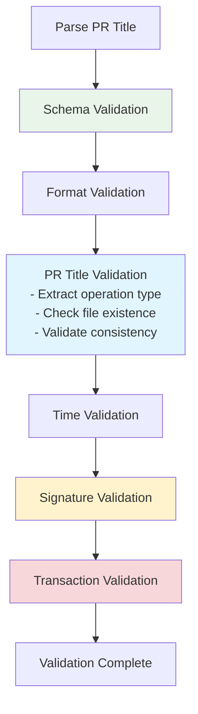

# 🔍 Validation Guide

> **Comprehensive guide for metadata validation system**

## 📋 Table of Contents

1. [Validation Overview](#validation-overview)
2. [Granular Validation](#granular-validation)
3. [Validation Steps](#validation-steps)
4. [Validation Strategy Guide](#validation-strategy-guide)
5. [Error Resolution](#error-resolution)

---

## 🔄 Validation Overview

The validation system ensures metadata accuracy and security through multiple verification layers:



### Validation Flow
1. **Parse PR Title**: Extract network, ID, and operation type from PR title format
2. **Execute Validation Steps**: Run selected validation steps sequentially:
   - Schema, Format, PR Title (includes file existence check), Time, Signature, Transaction
3. **Stop on Failure**: Immediate termination on any validation failure

---

## 🎯 Granular Validation

Execute specific validation steps for faster debugging and development.

### Available Steps

| Step | Description | Performance | Use Case |
|------|-------------|-------------|----------|
| `schema` | JSON schema validation | Fast ⚡ | Structure check |
| `format` | File format and path validation | Fast ⚡ | Basic format |
| `pr-title` | PR title consistency & file operation validation | Fast ⚡ | Title matching, file existence |
| `time` | Time validation (1-hour rule) | Fast ⚡ | Signature expiry |
| `signature` | Signature verification | Medium 🔄 | Cryptographic proof |
| `transaction` | On-chain transaction validation | Slow 🐌 | Blockchain data |

### Validation Commands

```bash
# Quick validation (schema + format only)
npm run validate:quick -- --pr-title "[Agenda] sepolia - 64 - Test" data/agendas/sepolia/agenda-64.json

# Local validation (no network calls)
npm run validate:local -- --pr-title "[Agenda] sepolia - 64 - Test" data/agendas/sepolia/agenda-64.json

# Full validation (including on-chain)
npm run validate -- --pr-title "[Agenda] sepolia - 64 - Test" data/agendas/sepolia/agenda-64.json

# Individual validation steps
npm run validate:schema -- --pr-title "[Agenda] sepolia - 64 - Test" data/agendas/sepolia/agenda-64.json
npm run validate:signature -- --pr-title "[Agenda] sepolia - 64 - Test" data/agendas/sepolia/agenda-64.json
npm run validate:transaction -- --pr-title "[Agenda] sepolia - 64 - Test" data/agendas/sepolia/agenda-64.json
```

---

## 📝 Validation Steps

The validation system performs the following steps in sequence:

### 1. Schema Validation
- **Purpose**: Verify JSON structure and required fields
- **Checks**: Field types, required properties, format constraints
- **Speed**: Fast ⚡
- **Dependencies**: None

### 2. Format Validation
- **Purpose**: Validate file paths and naming conventions
- **Checks**: File location, naming pattern, network consistency
- **Speed**: Fast ⚡
- **Dependencies**: None

### 3. PR Title Validation
- **Purpose**: Ensure PR title matches metadata content and validate file operations
- **Checks**:
  - Title format (`[Agenda]` or `[Agenda Update]`)
  - Network/ID consistency with metadata
  - Operation type detection (create vs update)
  - File existence verification (GitHub main branch)
  - **Create operation**: File must NOT exist on main branch
  - **Update operation**: File must exist on main branch
- **Speed**: Fast ⚡
- **Dependencies**: GitHub API (for file existence check)

### 4. Time Validation
- **Purpose**: Verify signature timing constraints
- **Checks**: 1-hour validity window, time sequence for updates
- **Speed**: Fast ⚡
- **Dependencies**: None

### 5. Signature Validation
- **Purpose**: Cryptographic verification of metadata authenticity
- **Checks**: Signature format, message reconstruction, address recovery
- **Speed**: Medium 🔄
- **Dependencies**: Cryptographic operations

### 6. Transaction Validation
- **Purpose**: Verify on-chain transaction data consistency
- **Checks**: Transaction existence, sender verification, calldata matching
- **Speed**: Slow 🐌
- **Dependencies**: RPC endpoint, network connectivity

---

## ⚡ Validation Strategy Guide

### Recommended Workflow

| Step | Command | When to Use |
|------|---------|-------------|
| **Development** | `npm run validate:quick` | Rapid iteration, structure checks |
| **Pre-submission** | `npm run validate:local` | Before final submission |
| **Final check** | `npm run validate` | Before creating PR |

### Optimization Tips

- **Start Fast**: Use `validate:quick` during development (fastest - schema + format only)
- **Test Locally**: Use `validate:local` for comprehensive checks without network calls
- **Final Validation**: Use full `validate` only before PR submission (includes on-chain verification)
- **Debug Issues**: Use individual validation scripts to isolate problems

---

## 🛠️ Error Resolution

### Common Validation Errors

#### Schema Validation Errors
```bash
❌ Schema validation failed: Missing required field 'createdAt'
```
**Solution**: Add missing required fields to metadata file

#### Signature Validation Errors
```bash
❌ Signature has expired. Signature time: 2024-01-01T10:00:00.00Z
```
**Solution**: Generate new signature within 1-hour window

#### Transaction Validation Errors
```bash
❌ Transaction not found: 0x1234...
```
**Solution**: Verify transaction hash and network, ensure transaction is confirmed

#### Calldata Validation Errors
```bash
❌ Actions do not match transaction calldata
```
**Solution**: Verify `contractAddress` and `calldata` arrays match transaction data

### Debugging Strategy

1. **Quick Check** → `npm run validate:quick` (structure issues)
2. **Local Check** → `npm run validate:local` (signature/time issues)
3. **Isolate Issues** → `npm run validate:signature` or `npm run validate:transaction`
4. **Final Check** → `npm run validate` (complete validation)

### Error Categories

| Error Type | Validation Step | Fix Difficulty | Common Cause |
|------------|----------------|----------------|--------------|
| Schema errors | `schema` | Easy | Missing/wrong fields |
| Format errors | `format` | Easy | File path/naming |
| Time errors | `time` | Easy | Expired signature |
| Signature errors | `signature` | Medium | Wrong wallet/message |
| Transaction errors | `transaction` | Hard | On-chain data mismatch |

---

## 🔗 Related Guides

- **📚 [Getting Started](getting-started.md)**: Complete setup and usage
- **✍️ [Signature Guide](signature-guide.md)**: Signature generation details
- **🗂️ [Schema Reference](schema-reference.md)**: Metadata structure
- **❓ [FAQ](faq.md)**: Common questions and solutions

---

**💡 Need help? Use granular validation to isolate issues quickly!**