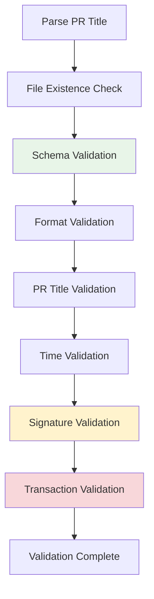

# �� Validation Guide

> **Comprehensive guide for metadata validation system**

## 📋 Table of Contents

1. [Validation Overview](#validation-overview)
2. [Granular Validation](#granular-validation)
3. [Validation Steps](#validation-steps)
4. [Performance Guide](#performance-guide)
5. [Error Resolution](#error-resolution)

---

## 🔄 Validation Overview

The validation system ensures metadata accuracy and security through multiple verification layers:



### Validation Flow
1. **Parse PR Title**: Extract network, ID, and operation type
2. **File Existence**: Verify file exists/doesn't exist based on operation
3. **Execute Steps**: Run selected validation steps sequentially
4. **Stop on Failure**: Immediate termination on any validation failure

---

## 🎯 Granular Validation

Execute specific validation steps for faster debugging and development.

### Available Steps

| Step | Description | Performance | Use Case |
|------|-------------|-------------|----------|
| `schema` | JSON schema validation | Fast ⚡ | Structure check |
| `format` | File format and path validation | Fast ⚡ | Basic format |
| `pr-title` | PR title consistency validation | Fast ⚡ | Title matching |
| `time` | Time validation (1-hour rule) | Fast ⚡ | Signature expiry |
| `signature` | Signature verification | Medium 🔄 | Cryptographic proof |
| `transaction` | On-chain transaction validation | Slow 🐌 | Blockchain data |

### Command Usage

```bash
# Individual validation steps
npm run validate -- --check schema data/agendas/sepolia/agenda-64.json
npm run validate -- --check signature --pr-title "[Agenda] sepolia - 64 - Test" data/agendas/sepolia/agenda-64.json
npm run validate -- --check transaction --pr-title "[Agenda] sepolia - 64 - Test" data/agendas/sepolia/agenda-64.json

# Multiple steps
npm run validate -- --check schema,format,pr-title --pr-title "[Agenda] sepolia - 64 - Test" data/agendas/sepolia/agenda-64.json

# All steps (default)
npm run validate -- --pr-title "[Agenda] sepolia - 64 - Test" data/agendas/sepolia/agenda-64.json
```

### NPM Scripts

```bash
# Quick validation (schema + format)
npm run validate:quick -- --pr-title "[Agenda] sepolia - 64 - Test" data/agendas/sepolia/agenda-64.json

# Local validation (no RPC calls)
npm run validate:local -- --pr-title "[Agenda] sepolia - 64 - Test" data/agendas/sepolia/agenda-64.json

# Individual steps
npm run validate:schema -- --pr-title "[Agenda] sepolia - 64 - Test" data/agendas/sepolia/agenda-64.json
npm run validate:signature -- --pr-title "[Agenda] sepolia - 64 - Test" data/agendas/sepolia/agenda-64.json
npm run validate:transaction -- --pr-title "[Agenda] sepolia - 64 - Test" data/agendas/sepolia/agenda-64.json
```

---

## 📝 Validation Steps

### 1. Schema Validation
- **Purpose**: Verify JSON structure and required fields
- **Checks**: Field types, required properties, format constraints
- **Speed**: Fast ⚡
- **Dependencies**: None

### 2. Format Validation
- **Purpose**: Validate file paths and naming conventions
- **Checks**: File location, naming pattern, network consistency
- **Speed**: Fast ⚡
- **Dependencies**: None

### 3. PR Title Validation
- **Purpose**: Ensure PR title matches metadata content
- **Checks**: Title format, network/ID consistency, operation type
- **Speed**: Fast ⚡
- **Dependencies**: None

### 4. Time Validation
- **Purpose**: Verify signature timing constraints
- **Checks**: 1-hour validity window, time sequence for updates
- **Speed**: Fast ⚡
- **Dependencies**: None

### 5. Signature Validation
- **Purpose**: Cryptographic verification of metadata authenticity
- **Checks**: Signature format, message reconstruction, address recovery
- **Speed**: Medium 🔄
- **Dependencies**: Cryptographic operations

### 6. Transaction Validation
- **Purpose**: Verify on-chain transaction data consistency
- **Checks**: Transaction existence, sender verification, calldata matching
- **Speed**: Slow 🐌
- **Dependencies**: RPC endpoint, network connectivity

---

## ⚡ Performance Guide

### Development Workflow

```bash
# 1. Quick structure check (fastest)
npm run validate:quick

# 2. Local validation (fast, no network)
npm run validate:local

# 3. Full validation (before PR submission)
npm run validate
```

### Performance Comparison

| Validation Type | Time | Network Required | Use Case |
|----------------|------|------------------|----------|
| `validate:quick` | ~100ms | No | Development |
| `validate:local` | ~500ms | No | Pre-submission |
| `validate` | ~2-5s | Yes | Final check |

### Optimization Tips

- **Development**: Use `validate:quick` for rapid iteration
- **Testing**: Use `validate:local` for comprehensive local checks
- **Submission**: Use `validate` only before final PR submission
- **Debugging**: Use individual `--check` options to isolate issues

---

## 🛠️ Error Resolution

### Common Validation Errors

#### Schema Validation Errors
```bash
❌ Schema validation failed: Missing required field 'createdAt'
```
**Solution**: Add missing required fields to metadata file

#### Signature Validation Errors
```bash
❌ Signature has expired. Signature time: 2024-01-01T10:00:00.00Z
```
**Solution**: Generate new signature within 1-hour window

#### Transaction Validation Errors
```bash
❌ Transaction not found: 0x1234...
```
**Solution**: Verify transaction hash and network, ensure transaction is confirmed

#### Calldata Validation Errors
```bash
❌ Actions do not match transaction calldata
```
**Solution**: Verify `contractAddress` and `calldata` arrays match transaction data

### Debugging Strategy

1. **Start with Quick Validation**
   ```bash
   npm run validate:quick
   ```

2. **Add Local Validation**
   ```bash
   npm run validate:local
   ```

3. **Isolate Specific Issues**
   ```bash
   npm run validate:signature
   npm run validate:transaction
   ```

4. **Full Validation**
   ```bash
   npm run validate
   ```

### Error Categories

| Error Type | Validation Step | Fix Difficulty | Common Cause |
|------------|----------------|----------------|--------------|
| Schema errors | `schema` | Easy | Missing/wrong fields |
| Format errors | `format` | Easy | File path/naming |
| Time errors | `time` | Easy | Expired signature |
| Signature errors | `signature` | Medium | Wrong wallet/message |
| Transaction errors | `transaction` | Hard | On-chain data mismatch |

---

## 🔗 Related Guides

- **📚 [Getting Started](getting-started.md)**: Complete setup and usage
- **✍️ [Signature Guide](signature-guide.md)**: Signature generation details
- **🗂️ [Schema Reference](schema-reference.md)**: Metadata structure
- **❓ [FAQ](faq.md)**: Common questions and solutions

---

**💡 Need help? Use granular validation to isolate issues quickly!**